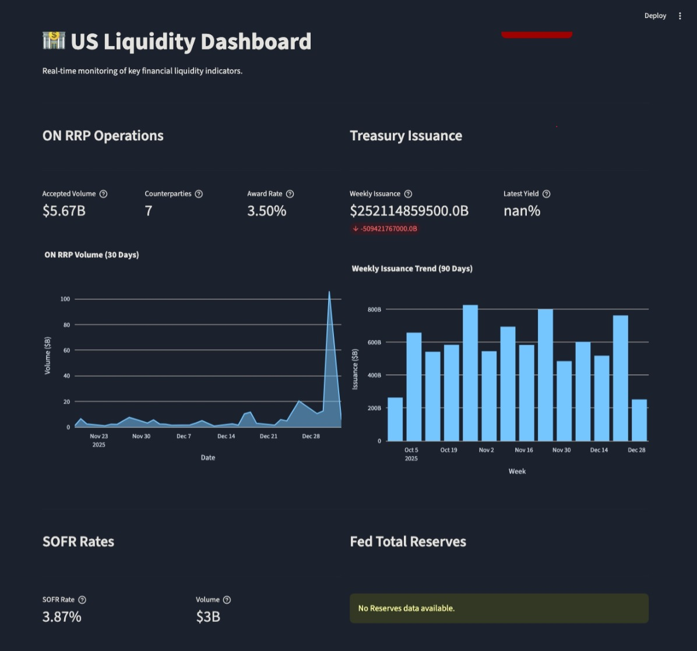

## Liquidity Dashboard

An interactive dashboard for visualizing and analyzing liquidity data from multiple sources, built with Streamlit and containerized for easy deployment.



---

### Project Structure

```
├── Dockerfile                # Container build instructions
├── requirements.txt          # Python dependencies
├── streamlit_app.py          # Main Streamlit app entry point
├── src/                      # Source code (data fetchers, UI components, config)
├── data/                     # Static data files
├── plots/                    # Generated plots
├── docs/                     # Documentation
└── LICENSE                   # MIT License
```

---

## 🚀 Quick Start (Docker)

The easiest way to run the application is using Docker. This ensures you have all the correct dependencies and environment updates.

### Prerequisites
- [Docker](https://www.docker.com/get-started) installed

### 1. Build the Docker image
```sh
docker build -t liquidity-dashboard .
```

### 2. Run the app
```sh
docker run -p 8501:8501 liquidity-dashboard
```
Then open [http://localhost:8501](http://localhost:8501) in your browser.

---

## 💻 Local Development

If you prefer to run the Python application directly on your machine:

1. **Clone the repository** and navigate to the directory.

2. **Create a virtual environment**:
   ```sh
   python3 -m venv venv
   source venv/bin/activate  # On Windows: venv\Scripts\activate
   ```

3. **Install dependencies**:
   ```sh
   pip install -r requirements.txt
   ```

4. **Run the app**:
   ```sh
   streamlit run streamlit_app.py
   ```

---

## 🔒 Security & data

This repository is designed to be public-safe:
- **Environment Variables**: Sensitive configuration should be loaded via `.env` files (which are git-ignored) or environment variables.
- **Data Privacy**: The `data/` directory ignores CSV files by default (except configuration files like `visualization_fields.csv`). Ensure you do not commit private financial data if you fork this repository.
- **Container Security**: The `Dockerfile` runs as a non-root user (implied by Streamlit best practices, though currently running as default. For production, consider adding a user).

---

## 📦 Deployment

This application is container-ready and can be deployed to any platform that supports Docker:

1. **Docker Hub / GHCR**: Push your built image to a registry.
   ```sh
   docker tag liquidity-dashboard your-user/liquidity-dashboard:latest
   docker push your-user/liquidity-dashboard:latest
   ```

2. **Cloud Platforms**:
   - **AWS**: Deploy to ECS or App Runner.
   - **Azure**: Deploy to App Service for Containers or Azure Container Apps.
   - **GCP**: Deploy to Cloud Run.
   - **Self-Hosted**: Run with `docker-compose` or Kubernetes.

---

## 🤝 Contributing

Pull requests are welcome!
- See `docs/AGENTS.md` for details on how AI agents were used in this project.
- See `docs/REQUIREMENTS_REPORT.md` for a deep dive into the project dependencies.

---

## 📄 License

This project is licensed under the MIT License - see the [LICENSE](LICENSE) file for details.
